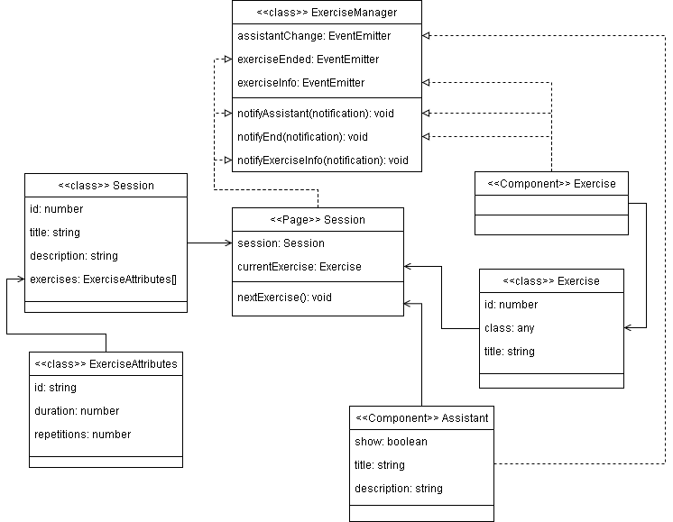

# TFG
TFG 19/20 - David Infante Casas

### Directory structure
```
docs/                       Project documentation
backend/
    api/                    Express microservices
frontend/src/
    app/                    App code
        classes/            Classes needed by the app
            exercises/      Classes needed by the exercises
        components/         Components used by the app
            exercises/      Exercise components
        directives/         All directives needed by the app
        pages/              All pages that can be navigated through the app
        services/           Services that grant data to elements that require it
            exercises/      Data needed by each exercise
    assets/                 Media files
        img                 Project's main images
        icon                App's favicon
        exercise            Images required by exercises
    theme/variables.scss    SCSS Global variables
```
### How the session page works
Session page implements ng-template using the ad-host directive, where the exercises will be loaded.  
Exercises are loaded using ComponentFactoryResolver and created with ViewContainerRef.  
This allows the programmer to create exercises freely and makes the app extensible.  
To allow freely exercise development, each exercise can change the Assistant status via exerciseManager.

Here's a diagram:


### How to add new Sessions:
- Edit the file `/services/sessions.service.ts` adding a new element in the sessions array including:
  - The session's id
  - The title as a string
  - A description as a string
  - An array with the session's exercises (id, duration, repetitions)

### How to add new Exercises:
- Create or use any components you may need and pack them up in a component with the full exercise
  - Your main component class must have these attributes
  ```
  private userId: number;
  private exerciseAttributes: ExerciseAttributes;
  ``` 
  - Include the object `exerciseManager` in your main exercise class
  - Add this code in the constructor
  ```
  exerciseManager.exerciseInfo.subscribe( data => {
    this.userId = data.userId;
    this.exerciseAttributes = data.attributes;
  });
  ```
  - Add this code to the function that is called when the exercise ends
   ```
  exerciseManager.notifyEnd({
    id: this.exerciseAttributes.id,
    success: true
  });
  ```
  - If you need to change the text in the Assistant or hide it do it like this: 
  ```
  exerciseManager.notifyAssistant({
    show: (true/false),
    title: 'Your title',
    description: 'Your description'
  });
  ```
  - To send the exercise's results you can use ```ExerciseResultsService``` like this:
  ```this.exerciseResultsService.addResult(this.userId, this.exerciseAttributes.id, this.score).subscribe(res => {}); ```
- Include the component's class in the `declarations: [...]` and `entryComponents: [...]` 
        sections at `/pages/session/session.module.ts`
- Edit the file `/services/exercises.service.ts` adding a new element in the exercises array including:
  - The exercise's id, this id must be the same as the one 
  specified in the session's exercises array
  - The component's class that packs the full exercise
  - The title of the exercise as a string
